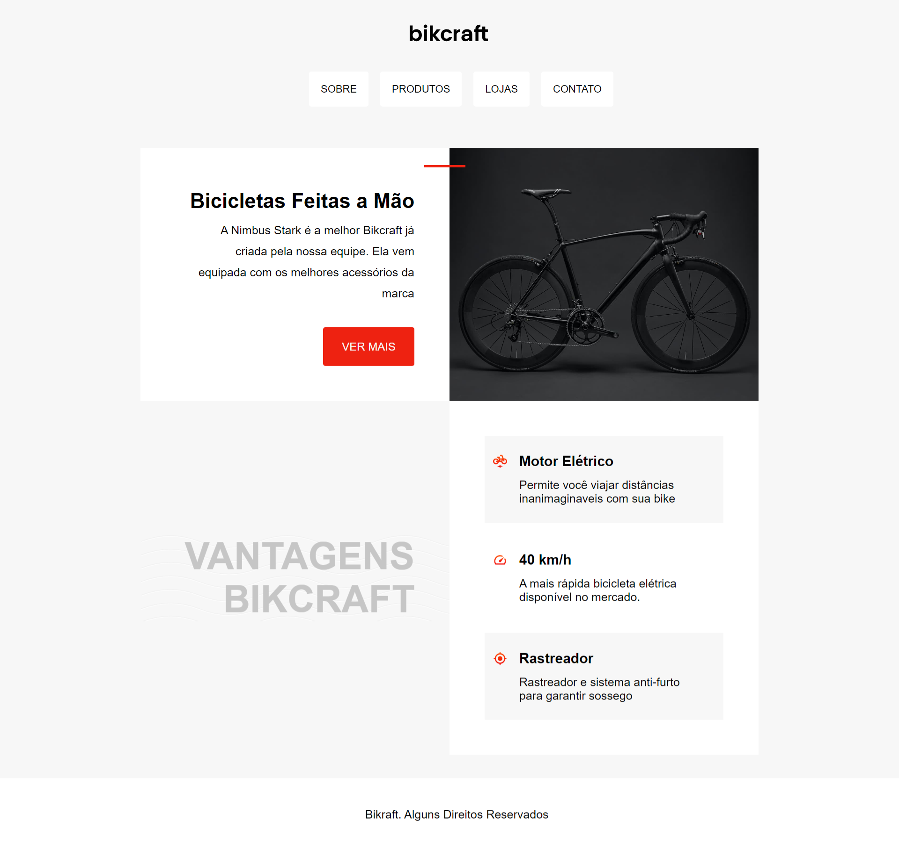

<p align="center"></p>


<h2 align="center">🚴‍♂️ Bikcraft</h2>

**Bikcraft** é um projeto de e-commerce fictício criado para a venda de bicicletas personalizadas. O site foi desenvolvido utilizando exclusivamente HTML e CSS, com foco em uma interface limpa, simples e moderna. Este projeto faz parte do curso **Origamid** e foi elaborado para praticar habilidades de front-end, com atenção especial ao design e à experiência do usuário.




## 📋 Descrição do Projeto

O objetivo do Bikcraft é apresentar uma loja fictícia que comercializa bicicletas exclusivas. O site é composto por uma única página contendo vária informações sobre o produto. Todo o layout foi construído utilizando apenas HTML para a estruturação e CSS para a estilização, sem o uso de JavaScript ou frameworks.

## 🔧 Tecnologias Utilizadas

- **HTML5** - Para a estrutura do conteúdo
- **CSS3** - Para a estilização e layout responsivo
- **Flexbox e Grid Layout** - Para a organização e disposição dos elementos

## 🚀 Funcionalidades

- Página inicial com informações sobre o produto
- Animações sutis em CSS para melhorar a interatividade visual

## 📂 Estrutura de Pastas

```bash
Bikcraft/
│
├── assets/                # Pasta de ativos
│   ├── style.css          # Arquivo principal de estilos
│   ├── colors.css         # Arquivo de cores
│   ├── media-queries.css  # Arquivo para responsividade
│   └── img/               # Pasta de imagens
│
├── index.html             # Página inicial
└── README.md              # Documentação do projeto
```

## 🖥️ Como Rodar o Projeto Localmente

1. Clone o repositório:

```bash
git clone https://github.com/sarahbeirigo/bikcraft-origamid.git
```

2. Navegue até o diretório do projeto:

```bash
cd bikcraft-origamid
```

3. Abra o arquivo `index.html` diretamente no navegador para visualizar o site.

## ✍️ Aprendizados

Neste projeto, aprofundei meu conhecimento em:

- Desenvolvimento de layouts responsivos utilizando **Flexbox** e **CSS Grid**
- Boas práticas de semântica em HTML5
- Criação de estilos modularizados e reutilizáveis em CSS

## 💡 Melhorias Futuras

- [x] Design responsivo adaptado para diferentes tamanhos de tela (desktop e mobile)
- [ ] Adição de interatividade com JavaScript, como animações mais complexa
- [ ] Implementação de um sistema dinâmico para o envio de mensagens no formulário de contato

## 📝 Contato

Se você quiser saber mais sobre o projeto ou entrar em contato:

 <a href = "mailto:sarahcbeirigo@gmail.com"></a>
  <a href="https://www.linkedin.com/in/sarah-beirigo/" target="_blank"></a> 

##
<p align="center">👩🏼‍💻 code by <a href="https://github.com/sarahbeirigo">Sarah Beirigo</a></p>
